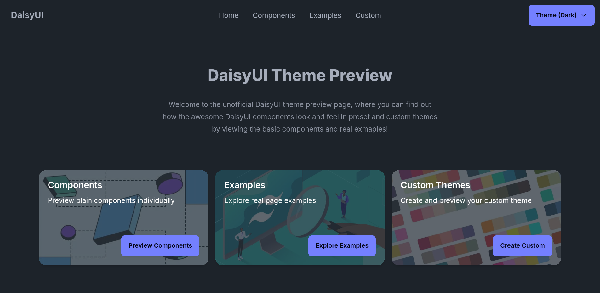

# This project is archived due to DaisyUI V5 having a good theme picker/customizer!

 
 
 

    
    
    

 

# DaisyUI Theme Preview

## Preview Preset & Custom DaisyUI Themes with Plain Components and Realistic Examples

This project was created to help the DaisyUI community choose the perfect DaisyUI theme for their needs, experiment with their own theme configurations, and explore all DaisyUI plain components along with some real website examples.

 

## ✏️ Contributing

Contributions to this project are very well welcome!

With DaisyUI v5 on the horizon, any assistance in keeping this project up-to-date is greatly appreciated.

Additionally, I would like to expand the collection of website examples. Feel free to include some great layouts and get an attribution!

Feel free to contribute in any way you can. Your PR will be reviewed accordingly in shortest possible time.

Please read the [CONTRIBUTING.md](https://github.com/BakirGracic/daisyui-theme-preview/blob/main/CONTRIBUTING.md) to understand the process and align your PR with our guidelines. Happy coding!

 

### 🤝 Acknowledgements

A big thank you to the creator [@saadeghi](https://github.com/saadeghi) and the maintainers, supporters, and contributors of DaisyUI, Tailwind, and all other amazing technologies used in this project!

 

### 📣 Attributions

- https://github.com/robbins23/daisyui-admin-dashboard-template (used in Simple Dashboard example)

 

### 🏛️ License

This project is licensed under the MIT License. See the [LICENSE.md](https://github.com/BakirGracic/daisyui-theme-preview/blob/main/LICENSE.md) file for details.
